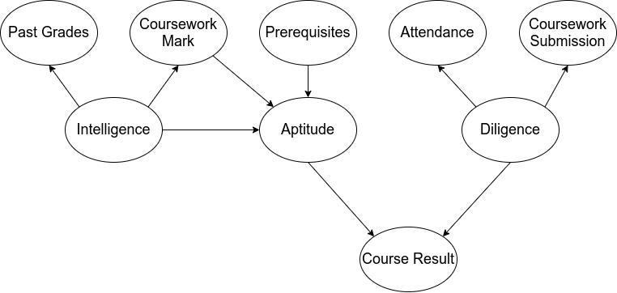

# BN-Explain

BN-Explain is an environment to algorithmically generate prediction explanations for BNs. The algorithm follows two general steps: content generation and narrative generation.

## 1. Introduction

The BN-Explain code consists of python and R components. The python code provides the end user a console interface to create explainable BNs and enter queries for explanations, it also uses the realisation engine `simplenlg` for natural language generation for the explanation narrative. The R code applies the Kyrimi 2020 algorithm for explanation content generation, it also uses `gRain` library to run probabilistic inference. 

Explainable BNs are extended BN models with additional layers. An explainable BN consists of the underlying BN, the contextual layer (called explanandum), and the linguistic layer (called phrase schema). The realisation step allows for application of different templates for the flow of information.

Below the configuration of an explainable BN and the use of BN-Explain are demonstrated with an example.

## 2. Configuring an Explainable BN

An explainable BN consists of three main components: BN, explanandum, and phrase schema. The underlying BN can be defined parsing a .cmpx file. The explanandum and phrase schema are defined using .json files.

### 2.1 The Underlying BN

Currently BN-Explain uses the model definition format .cmpx to input BNs. This is the file format native to agena.ai. The .cmpx file, in its essence, is a .json file of all information that defines a BN (also with additional fields related to the GUI of agena.ai modeller that are not necessary to define a BN, thus ignored in the configuration of an explainable BN here). The BN that is created using the inputted .cmpx file contains information about model structure (variables, variable states, and arcs between variables) and model parameters (all the NPTs). The .cmpx file can be used to define hybrid BNs (with discrete and continuous variables) and the Kyrimi 2020 algorithm has capabilities to deal with continuous variables; however, we only demonstrate BN-Explain capabilities with discrete BNs.

As an example, throughout this manual, we are going to use a BN that predicts the students' probability of passing a course, called 'course success BN'.

Course success BN predicts a student’s course result in terms of a fail or a pass. This result is based on the student’s diligence and aptitude for the course. The aptitude for the course is determined by the student’s intelligence, their status of the prerequisites, and their coursework marks. Intelligence is indicated by the student’s past grades and coursework marks. Diligence is indicated by the student’s attendance to the course lectures and coursework
submission times.

The model structure can be seen in Figure 1.




### 2.2 Explanandum

Currently the explanandum file is configured in the way that R code can parse, as the following example for the course success BN where the target is Course Result and the state of interest is Pass.

```json
{
	"categoryList": [
		"Evidence",
		"Evidence",
		"Evidence",
		"None",
		"Intermediate",
		"Target",
		"Evidence",
		"Intermediate",
		"Evidence"
	],
	"stateOfInt": "Pass"
}
```

The ideal format for the explanandum is as follows. This is going to be a part of the next update for improving the user experience.

```json
{
    "target": {
        "id": "Result",
        "state_of_interest": "Pass"
    },
    "intermediate": {
        "causal": [
            "Dilligence",
            "Aptitude"
        ],
        "explainaway": []
    },
    "evidence": [
        "PastGrades",
        "Marks",
        "Attendance",
        "Submission",
        "Prerequisites"
    ]
}
```

### 2.3 Phrase Schema

Phrase schema consists of all lists of authored phrases and the corresponding probability thresholds. Once the explanation content is generated, the schema is used to select correct phrases for this case and shape the narrative.

A schema example for course success BN in English, including probability phrases for the target and intermediate variables.

```json
{
    "subject_name": "this student",
    "target": {
        "id": "Result",
        "display_name": "passing the course",
        "states": [
            "Fail",
            "Pass"
        ],
        "state_display_name": [
            "no",
            "yes"
        ],
        "categories": [
            {
                "type": "probability",
                "levels": [
                    "very low probability",
                    "low probability",
                    "medium probability",
                    "high probability",
                    "very high probability"
                ],
                "thresholds": [
                    0.05,
                    0.3,
                    0.55,
                    0.8,
                    1
                ]
            }
        ]
    },
    "evidence": [
        {
            "id": "PastGrades",
            "display_name": "past grades",
            "states": [
                "Low",
                "Medium",
                "High"
            ],
            "state_display_name": [
                "low",
                "medium",
                "high"
            ]
        },
        {
            "id": "Mark",
            "display_name": "coursework mark",
            "states": [
                "Low",
                "High"
            ],
            "state_display_name": [
                "low",
                "high"
            ]
        },
        {
            "id": "Attendance",
            "display_name": "attendance",
            "states": [
                "Low",
                "Medium",
                "High"
            ],
            "state_display_name": [
                "low",
                "medium",
                "high"
            ]
        },        
        {
            "id": "Submission",
            "display_name": "coursework submissions",
            "states": [
                "LateSubmit",
                "OnTime"
            ],
            "state_display_name": [
                "late",
                "timely"
            ]
        },
        {
            "id": "Prerequisites",
            "display_name": "prerequisite modules",
            "states": [
                "Missing",
                "Completed"
            ],
            "state_display_name": [
                "missing",
                "completed"
            ]
        }
    ],
    "numerical_variables": [],
    "intermediate": [
        {
            "id": "Diligence",
            "display_name": "diligence",
            "states": [
                "No",
                "Yes"
            ],
            "state_display_name": [
                "no",
                "yes"
            ],
            "state_of_interest" : "Yes",
            "type" : "causal",
            "categories": [
                {
                    "type": "probability",
                    "levels": [
                        "very low probability",
                        "low probability",
                        "medium probability",
                        "high probability",
                        "very high probability"
                    ],
                    "thresholds": [
                        0.05,
                        0.3,
                        0.55,
                        0.8,
                        1
                    ]
                }
            ]
        },
        {
            "id": "Aptitude",
            "display_name": "aptitude",
            "states": [
                "No",
                "Yes"
            ],
            "state_display_name": [
                "no",
                "yes"
            ],
            "state_of_interest" : "Yes",
            "type" : "causal",
            "categories": [
                {
                    "type": "probability",
                    "levels": [
                        "very low probability",
                        "low probability",
                        "medium probability",
                        "high probability",
                        "very high probability"
                    ],
                    "thresholds": [
                        0.05,
                        0.3,
                        0.55,
                        0.8,
                        1
                    ]
                }
            ]
        }
    ]
}
```

### 2.4 Initialising the Explainable BN

We start with importing the BN-Explain functions.

```python
from bnexplain.realisation import *
from bnexplain.content_generation import *
```

Now we can define the paths of BN, explanandum, and schema; as well as define a case (using a dict). For the cases, in the dict, model variable ids are used as keys and their observed states/values are used as values.

```python
bn_path = 'examples/course_success_bn.cmpx'
explanandum_path = 'examples/course_success_explanandum.json'
schema_path = 'examples/course_success_schema.json
```

Two example cases (students):

```python
alice = {'PastGrades':'High',
         'Mark':'High',
         'Attendance':'Low',
         'Submission':'LateSubmit',
         'Prerequisites':'Missing',
        }

barry = {'PastGrades':'Medium',
         'Mark':'High',
         'Attendance':'High',
         'Submission':'OnTime'
        }
```

## 3. Using BN-Explain

Once the explainable BN is configured with the corresponding .json files, the explanation generation capabilities can be used. BN-Explain aims to generate explanations of AI reasoning, which are called local explanations and are specific to each prediction of the model. Therefore, to generate one of these explanations, a case should be inputted together with the explainable BN.

`explain_reasoning()` function takes as inputs the explainable BN and the case. The BN input requires specifying whether it is a `discrete` or a `discretised_continuous` BN with the use of `bn_type` parameter. If the .cmpx file contains any statically discretised continuous variable, the latter should be used.

```python
course_success_example = explain_reasoning(bn = bn_path,
                  bn_type = 'discretised_continuous',
                  explanandum = explanandum_path,
                  case = student_one,
                  schema = schema_path)

print(course_success_example)
```


Below, we are running content and narrative functions separately to generate same results. This is preferable if multiple explanations will be generated on the same content (the content json is created once)

### 3.1 Content Generation

Note that the linguistic layer is not required to create the explainable BN for perturbation of evidence, inference and content generation.

```python
course_exp_bn = create_exp_bn_disc(bn_path, bn_explanandum)

course_content_one = generate_exp_content(course_exp_bn, student_one, 'examples/student_one_content.json')

course_content_one = generate_exp_content(course_exp_bn, student_two, 'examples/student_two_content.json')
```

### 3.2 Narrative Generation

```python
course_content_one = 'examples/student_one_content.json'
course_content_two = 'examples/student_two_content.json'
```

```python
course_success_example = generate_explanation(course_content_one, schema_path)

print(course_success_example)
```

### 3.3 Changing Template for Different Model and Variable Structures

With the explanation generation query, we can change the template of the narrative and display the explanation in different flows and formats.

* bn_type: 'discrete' or 'discretised_continuous'
* intermediate_type = 'causal' or 'explainaway'
* intermediate_statement = 'mostlikely' or 'riskcategory' or 'mixed' (future update)
* category_type = 'probabilitychange' or 'risk'

